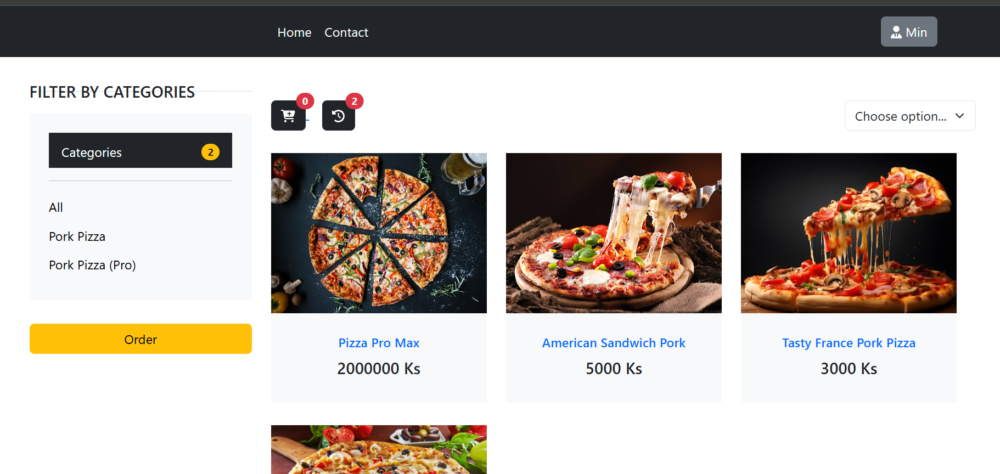
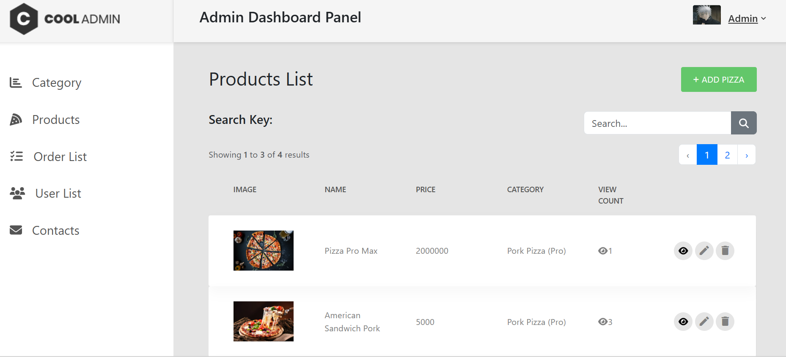

# Pizza Order System

This system is designed to simplify the process of selling products and services, while also providing accurate and real-time inventory management.

## Screenshots
  
### Customer View

### Admin View

## Admin

 - When login, admin role can go to admin dashboard.
 - Admin can manage CRUD products.
 - Admin can manage his account detail, can also change password.
 - Admin can manage user's roles.
 - Admin can manage orders from users.

## Users

- Users can see products home page.
- Users can manage their accounts, can also change passwords.
- Users can order products with cart system.
- Users can filter products with category and ascending or descending.

## Technologies Used

- Laravel (9)
- jQuery 
- Ajax
- Html/Css
- Bootstrap 5
- Fontawesome

## This web app is fully responsive.

## Installation

- If cloning my project is complete or download is complete, open terminal in project directory.
- Install composer dependicies
  - **composer install** (command)
- Install npm dependicies
  - **npm install**
- Create a copy of .env file
  - **cp .env.example .env**
- Generate an app encryption key
  - **php artisan key:generate**
- Create an empty database for my web project
  - created database name must match from .env file
- Delete storage folder from public/ and link storage
  - **php artisan storage:link**
- Migrate
  - **php artisan migrate**
- Seed Database
  - **php artisan db:seed**
- Start 
  - **php artisan serve**
- type in url with port 
  - localhost:8000

## Usage 

- Need Internet!
- In DatabaseSeeder.php, I created admin account.
- Login as an admin
  - Email - admin@gmail.com 
  - Password- password

